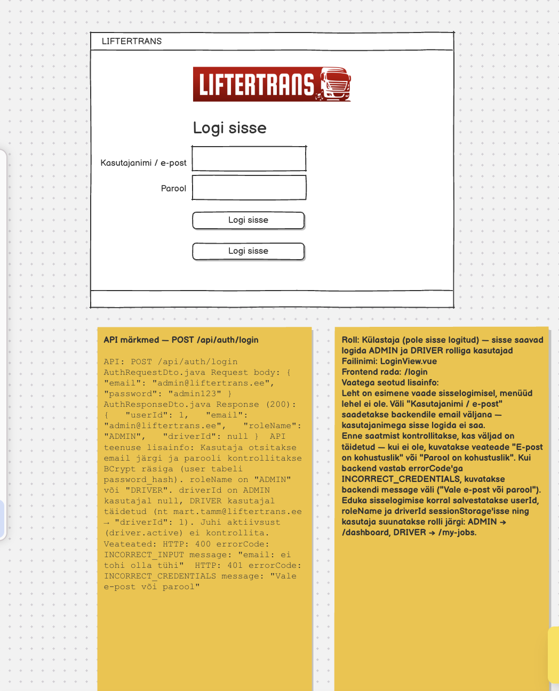

# Sisselogimine e-posti ja parooliga

**Vaade:** `LoginView.vue`, route `/login`

**Roll:** Külastaja (pole sisse logitud) — sisse saavad logida ADMIN ja DRIVER rolliga kasutajad

**Vaste balsamic mockupis:** "LIFTERTRANS mock-up (3).pdf", lehekülg 1/27 (vt lisatud pilt `Sisselogimine-e-posti-ja-parooliga.png`)



## Kasutajavoog

Kasutaja avab rakenduse sisselogimise lehe `/login`, kus on LIFTERTRANS logo, pealkiri "Logi sisse", e-posti ja parooli väli ning nupp "Logi sisse". Lehel ei ole menüüd. Kasutaja sisestab oma e-posti ja parooli ning vajutab "Logi sisse". Frontend kontrollib, et mõlemad väljad on täidetud, ja saadab andmed backendile `POST /api/auth/login` päringuga. Õnnestumise korral salvestatakse kasutaja andmed sessionStorage'isse ja kasutaja suunatakse rolli järgi oma avalehele; vale e-posti või parooli korral kuvatakse veateade ja kasutaja jääb lehele.

## Kasutajaliidese elemendid

| Element | Tüüp | Kirjeldus/käitumine |
|---|---|---|
| LIFTERTRANS logo | Pilt | Kuvatakse vormi kohal. |
| "Logi sisse" | Pealkiri | Vormi pealkiri. |
| Veateade | Alert (Bootstrap `alert alert-danger`) | Kuvatakse ainult siis, kui `errorMessage` ei ole tühi. Näitab frontendi valideerimise või backendi veateadet. |
| Kasutajanimi / e-post | Tekstisisend (`type="email"`) | Kohustuslik. Väärtus saadetakse backendile väljana `email` — kasutajanimega sisse logida ei saa (vt märkust allpool). |
| Parool | Paroolisisend (`type="password"`) | Kohustuslik. Väärtus saadetakse väljana `password`. |
| "Logi sisse" | Nupp | Käivitab valideerimise ja sisselogimise päringu. Päringu ajal on nupp keelatud (`disabled`). |
| Laadimisindikaator | Spinner | Kuvatakse ainult päringu ajal (`isLoading === true`). |

> **Märkus (täpsusta enne implementeerimist):** mockupil on kaks ühesugust "Logi sisse" nuppu. Tõenäoliselt on üks neist kogemata kopeeritud — task eeldab ühte nuppu.
>
> **Märkus:** välja silt on mockupis "Kasutajanimi / e-post", kuid backend otsib kasutajat ainult e-posti järgi (`user` tabelis kasutajanime veergu ei ole). Kaalu sildi muutmist lihtsalt "E-post"-iks, et kasutajat mitte eksitada.

## Käitumine ja valideerimine

1. Lehe avamisel on väljad tühjad ja veateadet ei kuvata.
2. Nupule "Logi sisse" vajutades tühjendatakse eelmine veateade.
3. Frontendi valideerimine enne API kutset:
   - kui e-post on tühi → kuvatakse "E-post on kohustuslik" ja päringut ei saadeta;
   - kui parool on tühi → kuvatakse "Parool on kohustuslik" ja päringut ei saadeta.
4. Kui väljad on täidetud, seatakse `isLoading = true` ja saadetakse `POST /api/auth/login` päring body'ga `{ email, password }`.
5. Õnnestumise korral (200):
   - salvestatakse vastusest `userId`, `roleName` ja `driverId` sessionStorage'isse (`driverId` on ADMIN kasutajal `null`);
   - suunatakse kasutaja rolli järgi: `roleName === 'ADMIN'` → `/dashboard`, `roleName === 'DRIVER'` → `/my-jobs`.
6. Vea korral:
   - 401 `INCORRECT_CREDENTIALS` → kuvatakse backendi `message` väli ("Vale e-post või parool"), kasutaja jääb lehele;
   - 400 `INCORRECT_INPUT` → kuvatakse backendi `message` väli (tavaliselt ei juhtu, sest frontend valideerib väljad enne);
   - muu viga (nt backend ei vasta, 500) → suunatakse `/error` vaatele.
7. Päringu lõppedes (nii õnnestumise kui vea korral) seatakse `isLoading = false` (`.finally()`).

> **Märkus (täpsusta enne implementeerimist):** DRIVER kasutaja suunamise rada on Balsamiqi LoginView märkmes `/my-jobs`, kuid mockupi lk 22 (`DriverJobsView.vue`) märkmes on rada `/minu-tood`. Lepi kokku üks rada ja uuenda teine mockupi märge vastavaks.

## API kutsed

### `POST /api/auth/login`

**Backend allikas:** `AuthController.java`, `AuthService.java`, `AuthRequestDto.java`, `AuthResponseDto.java` (backend on juba implementeeritud)

**Backend task:** vt `docs/tasks/backend/POST-api-login.md`

> **Märkus:** backend task ei vasta enam koodile — taskis on path `/api/login` ja veakood `REQUIRED_FIELDS_MISSING`, koodis on path `/api/auth/login` ning tühja välja korral tuleb `INCORRECT_INPUT`. See task järgib koodi.

`AuthRequestDto.java` — request body:
```json
{
  "email": "admin@liftertrans.ee",
  "password": "admin123"
}
```

`AuthResponseDto.java` — response (200):
```json
{
  "userId": 1,
  "email": "admin@liftertrans.ee",
  "roleName": "ADMIN",
  "driverId": null
}
```

DRIVER kasutaja vastuse näide (`mart.tamm@liftertrans.ee` / `driver123`):
```json
{
  "userId": 2,
  "email": "mart.tamm@liftertrans.ee",
  "roleName": "DRIVER",
  "driverId": 1
}
```

**Veateated:**

| Status code | errorCode | message | Frontend käitumine |
|---|---|---|---|
| 401 | `INCORRECT_CREDENTIALS` | "Vale e-post või parool" | Kuvatakse `message` veateate alert'is, kasutaja jääb lehele. |
| 400 | `INCORRECT_INPUT` | "email: ei tohi olla tühi" (esimese vigase välja nimi + valideerimisteade) | Kuvatakse `message` veateate alert'is. Frontendi valideerimine peaks selle ära hoidma. |
| muu | — | — | Suunatakse `/error` vaatele. |

> **Märkus:** 400 vea `message` tekst tuleb Springi `@NotBlank` vaiketeatest ja võib sõltuda keelest (nt inglise keeles "email: must not be blank"). Frontend ei tohiks selle täpsele sõnastusele toetuda.

## Komponendid ja failistruktuur

- `frontend/src/views/LoginView.vue` — **on juba olemas** (pooleli). Praegu kontrollib see kasutajat frontendis kõvakodeeritud e-posti ja parooli järgi — see tuleb asendada päris API kutsega. Veateate alert, e-posti/parooli väljad, nupp ja spinner on template'is juba olemas; spinner kuvatakse praegu alati (vaja `v-if="isLoading"`). Logo on veel lisamata.
- `frontend/src/services/AuthService.js` — **on juba olemas**, meetod `postLoginRequest(authRequestDto)` teeb `axios.post('/api/auth/login', ...)`. Projekti struktuuridokument (`docs/frontend/projekti-struktuur.md`) näeb API teenustele ette kausta `src/api-services/` — otsusta, kas faili tõsta sinna või jätta `src/services/` alla.
- `frontend/src/router/index.js` — rada `/login` (`loginRoute`) **on juba olemas**. Radu `/dashboard` ja `/my-jobs` routeris **veel ei ole** — need lisatakse vastavate vaadete (`AdminView.vue`, `DriverJobsView.vue`) taskides. Kuni neid pole, lõpeb suunamine tühja lehega.
- `frontend/src/App.vue` — navigatsiooniriba kuvatakse praegu kõigil lehtedel. Mockupi järgi ei ole sisselogimise lehel menüüd, seega tuleb navbar `/login` rajal peita (täpsusta lahendus enne implementeerimist).
- Komponendi stiil: Options API vastavalt `docs/frontend/vue-komponendi-struktuur.md`-le — API päring `.then()/.catch()/.finally()` ahelana, vastus ja viga eraldi `handle...`-meetodites (nt `handleLoginResponse`, `handleLoginError`).

## Vastuvõtu kriteeriumid

- [ ] `/login` lehel on LIFTERTRANS logo, pealkiri "Logi sisse", e-posti väli, parooli väli ja üks "Logi sisse" nupp.
- [ ] Sisselogimise lehel ei kuvata menüüd/navigatsiooniriba.
- [ ] Tühja e-posti korral kuvatakse "E-post on kohustuslik" ja päringut ei saadeta.
- [ ] Tühja parooli korral kuvatakse "Parool on kohustuslik" ja päringut ei saadeta.
- [ ] Täidetud väljade korral saadetakse `POST /api/auth/login` päring body'ga `{ "email", "password" }` (läbi `AuthService.js`, mitte kõvakodeeritud kontrolliga).
- [ ] Päringu ajal on nupp keelatud ja spinner nähtav; päringu lõppedes spinner kaob.
- [ ] `admin@liftertrans.ee` / `admin123` sisselogimisel salvestatakse sessionStorage'isse `userId`, `roleName` ja `driverId` ning kasutaja suunatakse `/dashboard`.
- [ ] `mart.tamm@liftertrans.ee` / `driver123` sisselogimisel salvestatakse sessionStorage'isse `userId`, `roleName` ja `driverId` (`1`) ning kasutaja suunatakse DRIVER avalehele (`/my-jobs`).
- [ ] Vale e-posti või parooli korral kuvatakse "Vale e-post või parool" ja kasutaja jääb lehele.
- [ ] Ootamatu vea korral (nt backend ei tööta) suunatakse kasutaja `/error` vaatele.
